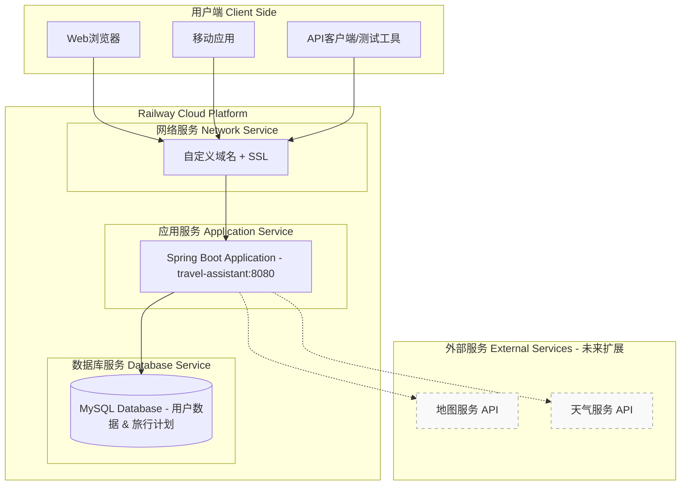
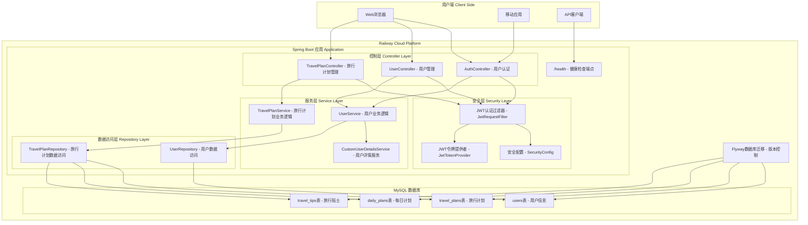
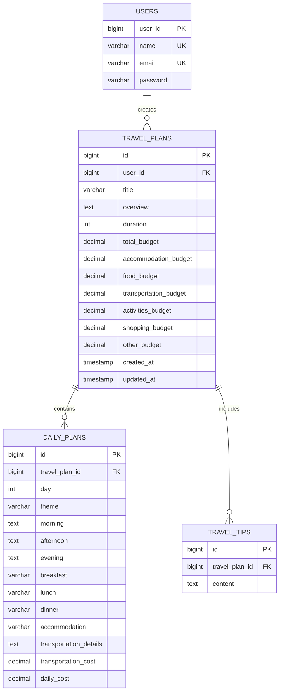
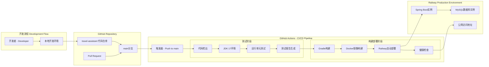
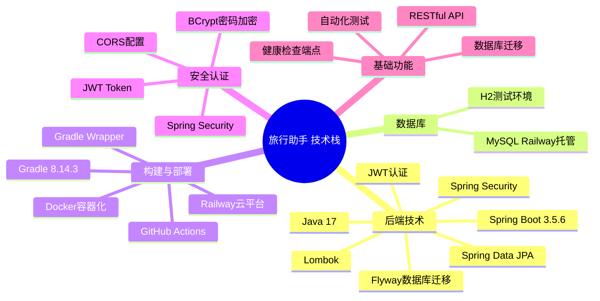
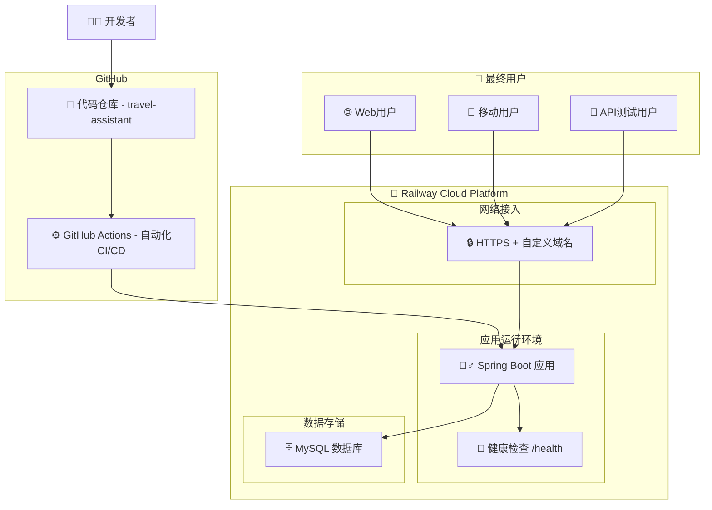
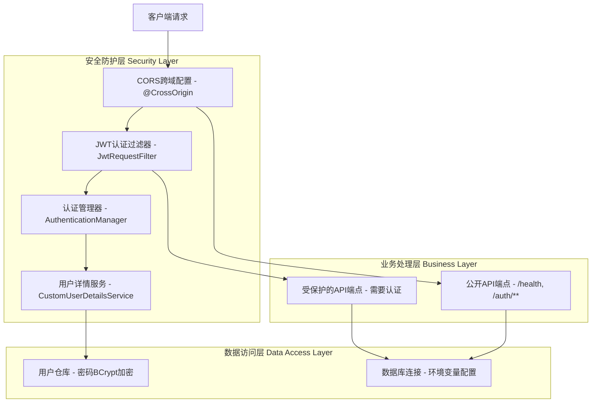

# 旅行助手系统架构图

## 整体架构概览

## 详细系统架构

## 实体关系图 (ERD)

## CI/CD与部署架构

## 技术栈总览

## 简化部署架构图

## 安全架构

## 核心功能模块

| 模块 | 功能描述 | 主要组件 | 现状 |
|------|----------|----------|------|
| 用户管理 | 用户注册、登录、JWT认证 | AuthController, UserService, SecurityConfig | ✅ 已实现 |
| 旅行计划 | 创建、查看、删除旅行计划 | TravelPlanController, TravelPlanService | ✅ 已实现 |
| 预算管理 | 预算分配和跟踪 | BudgetBreakdownDTO, 预算相关实体字段 | ✅ 已实现 |
| 每日行程 | 详细的每日旅行安排 | DailyPlan实体, DailyPlanDTO | ✅ 已实现 |
| 旅行贴士 | 个性化旅行建议 | TravelTip实体, 相关服务方法 | ✅ 已实现 |
| 数据持久化 | 数据库操作和迁移 | JPA Repositories, Flyway | ✅ 已实现 |
| 安全认证 | JWT令牌管理和权限控制 | Spring Security, JWT工具类 | ✅ 已实现 |
| CI/CD | 自动化测试、构建、部署 | GitHub Actions, Railway平台 | ✅ 已实现 |
| 健康检查 | 应用状态监控 | /health端点 | ✅ 已实现 |

## 项目特点

### ✅ **已实现的核心特性**
- **简洁架构**: 无复杂的网关、负载均衡器
- **云原生**: 基于Railway平台的一体化部署
- **自动化**: GitHub Actions完整的CI/CD流程
- **安全性**: JWT认证 + Spring Security
- **数据完整性**: Flyway数据库版本控制
- **容器化**: Docker部署，环境一致性

### 🎯 **架构优势**
- **开发简单**: 专注业务逻辑，无需复杂基础设施
- **部署便捷**: Railway一键部署，自动扩缩容
- **成本控制**: 按使用量付费，适合初期项目
- **快速迭代**: 自动化CI/CD，快速交付新功能

### 🚀 **未来扩展计划**
- **外部API集成**: 地图服务、天气API等
- **前端应用**: Web或移动端用户界面
- **缓存层**: Redis缓存提升性能
- **文件存储**: 图片、文档上传功能
