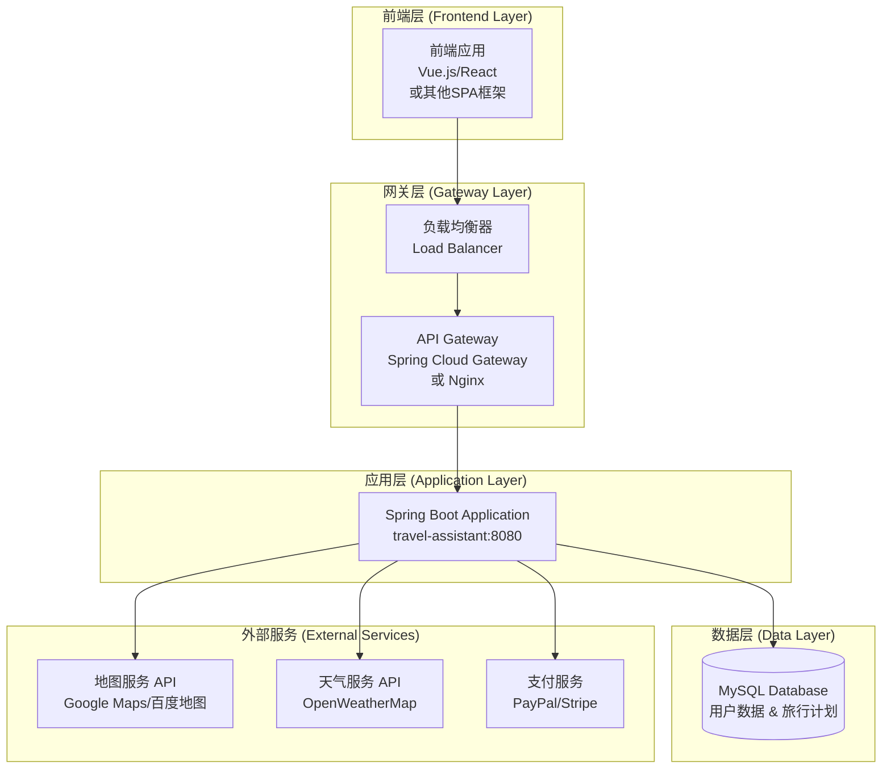
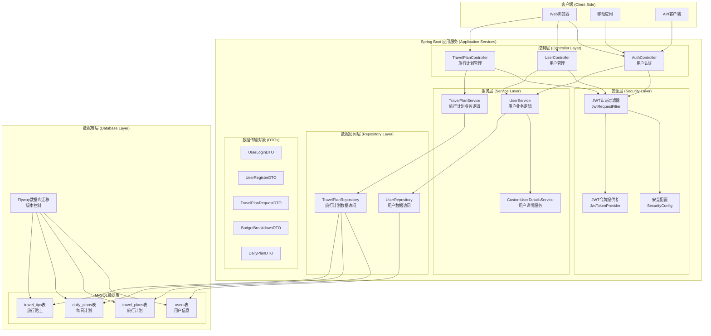
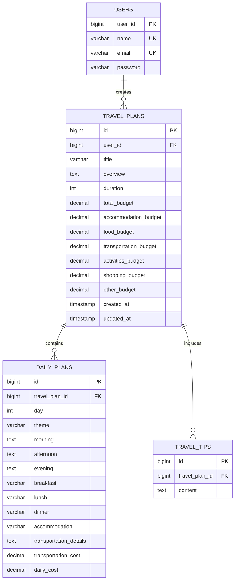
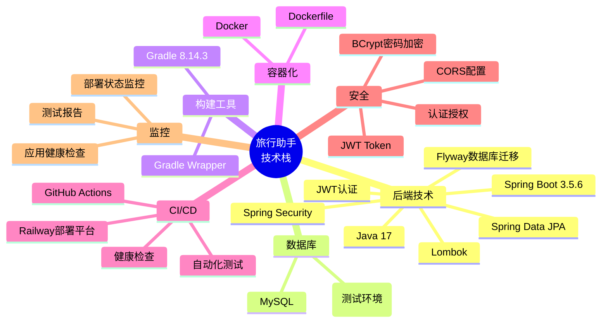
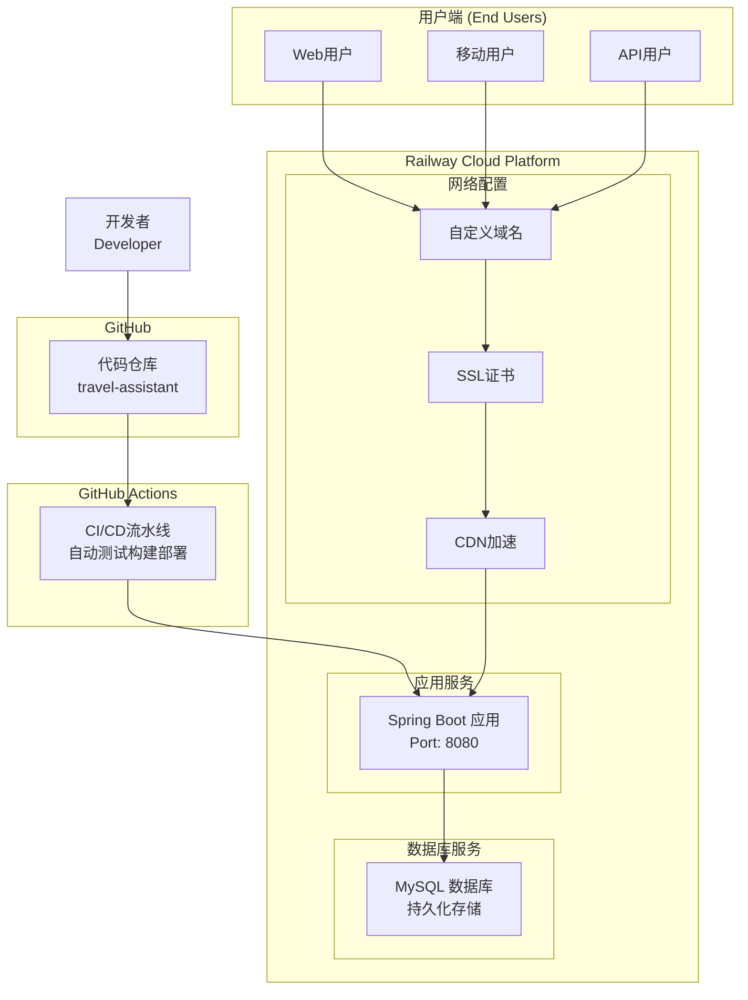

# 旅行助手系统架构图

## 整体架构概览



## 详细系统架构



## 实体关系图 (ERD)



## CI/CD流水线架构

```mermaid
graph LR
    %% 代码仓库
    subgraph "代码管理 (Source Control)"
        GH[GitHub Repository<br/>travel-assistant]
        MAIN[main分支]
        PR[Pull Request]
    end
    
    %% CI/CD流水线
    subgraph "CI/CD Pipeline (GitHub Actions)"
        subgraph "测试阶段 (Test Stage)"
            CHECKOUT[代码检出<br/>checkout@v4]
            JDK_SETUP[JDK 17设置<br/>setup-java@v4]
            CACHE[Gradle缓存<br/>cache@v4]
            TEST[运行测试<br/>./gradlew test]
            REPORT[测试报告<br/>test-reporter@v1]
        end
        
        subgraph "构建阶段 (Build Stage)"
            BUILD[构建应用<br/>./gradlew build]
            DOCKER_BUILD[Docker镜像构建]
        end
        
        subgraph "部署阶段 (Deploy Stage)"
            RAILWAY_CLI[Railway CLI安装]
            DEPLOY[部署到Railway<br/>railway up]
            HEALTH_CHECK[健康检查<br/>curl /health]
        end
    end
    
    %% 部署环境
    subgraph "部署环境 (Deployment Environments)"
        DEV[开发环境<br/>Railway Dev]
        STAGING[测试环境<br/>Railway Staging]
        PROD[生产环境<br/>Railway Prod]
    end
    
    %% 监控和日志
    subgraph "监控与日志 (Monitoring & Logging)"
        LOG[应用日志]
        METRICS[性能指标]
        ALERT[告警系统]
    end
    
    %% 流程连接
    GH --> MAIN
    PR --> MAIN
    MAIN --> CHECKOUT
    CHECKOUT --> JDK_SETUP
    JDK_SETUP --> CACHE
    CACHE --> TEST
    TEST --> REPORT
    REPORT --> BUILD
    BUILD --> DOCKER_BUILD
    DOCKER_BUILD --> RAILWAY_CLI
    RAILWAY_CLI --> DEPLOY
    DEPLOY --> HEALTH_CHECK
    HEALTH_CHECK --> DEV
    DEV --> STAGING
    STAGING --> PROD
    
    DEV --> LOG
    DEV --> METRICS
    METRICS --> ALERT
```

## 技术栈总览



## 部署架构图



## 安全架构

```mermaid
graph TB
    %% 请求入口
    CLIENT[客户端请求]
    
    %% 安全层
    subgraph "安全防护层 (Security Layer)"
        CORS[CORS跨域配置<br/>@CrossOrigin]
        JWT_FILTER[JWT认证过滤器<br/>JwtRequestFilter]
        AUTH_MANAGER[认证管理器<br/>AuthenticationManager]
        USER_DETAILS[用户详情服务<br/>CustomUserDetailsService]
    end
    
    %% 业务层
    subgraph "业务处理层 (Business Layer)"
        PROTECTED_API[受保护的API端点<br/>需要认证]
        PUBLIC_API[公开API端点<br/>/health, /auth/**]
    end
    
    %% 数据层
    subgraph "数据访问层 (Data Access Layer)"
        USER_REPO_SEC[用户仓库<br/>密码BCrypt加密]
        DB_SEC[数据库连接<br/>环境变量配置]
    end
    
    %% 安全流程
    CLIENT --> CORS
    CORS --> JWT_FILTER
    JWT_FILTER --> AUTH_MANAGER
    AUTH_MANAGER --> USER_DETAILS
    USER_DETAILS --> USER_REPO_SEC
    
    JWT_FILTER --> PROTECTED_API
    CORS --> PUBLIC_API
    
    PROTECTED_API --> DB_SEC
    PUBLIC_API --> DB_SEC
```

## 核心功能模块

| 模块 | 功能描述 | 主要组件 |
|------|----------|----------|
| 用户管理 | 用户注册、登录、JWT认证 | AuthController, UserService, SecurityConfig |
| 旅行计划 | 创建、查看、删除旅行计划 | TravelPlanController, TravelPlanService |
| 预算管理 | 预算分配和跟踪 | BudgetBreakdownDTO, 预算相关实体字段 |
| 每日行程 | 详细的每日旅行安排 | DailyPlan实体, DailyPlanDTO |
| 旅行贴士 | 个性化旅行建议 | TravelTip实体, 相关服务方法 |
| 数据持久化 | 数据库操作和迁移 | JPA Repositories, Flyway |
| 安全认证 | JWT令牌管理和权限控制 | Spring Security, JWT工具类 |
| CI/CD | 自动化测试、构建、部署 | GitHub Actions, Railway平台 |

这个架构图展示了你的旅行助手应用的完整技术架构，包括：

1. **分层架构**: 控制层、服务层、仓库层、安全层
2. **数据模型**: 用户、旅行计划、每日计划、旅行贴士
3. **安全机制**: JWT认证、Spring Security配置
4. **CI/CD流程**: GitHub Actions自动化部署到Railway
5. **技术栈**: Spring Boot 3.x, MySQL, Docker, Gradle
6. **部署方式**: 容器化部署到云平台

这是一个现代化的、生产就绪的Spring Boot应用架构。
