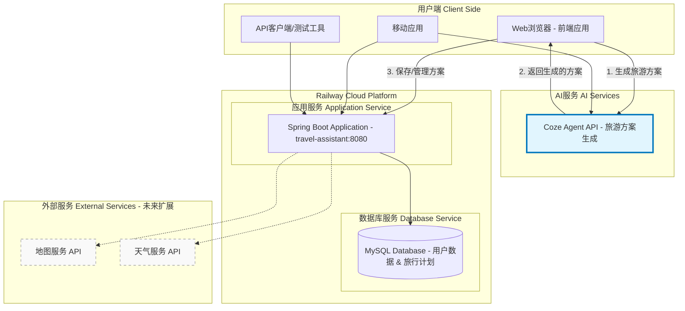
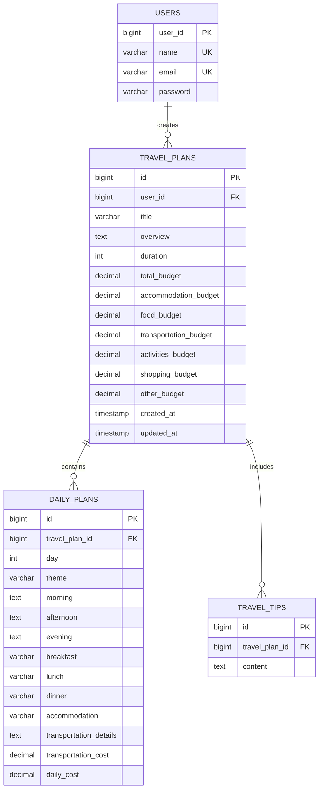
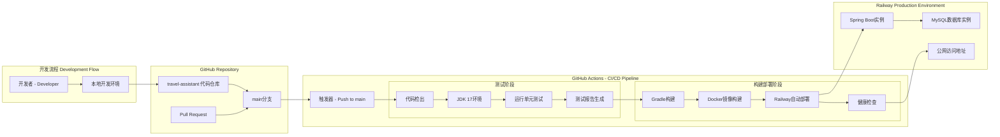
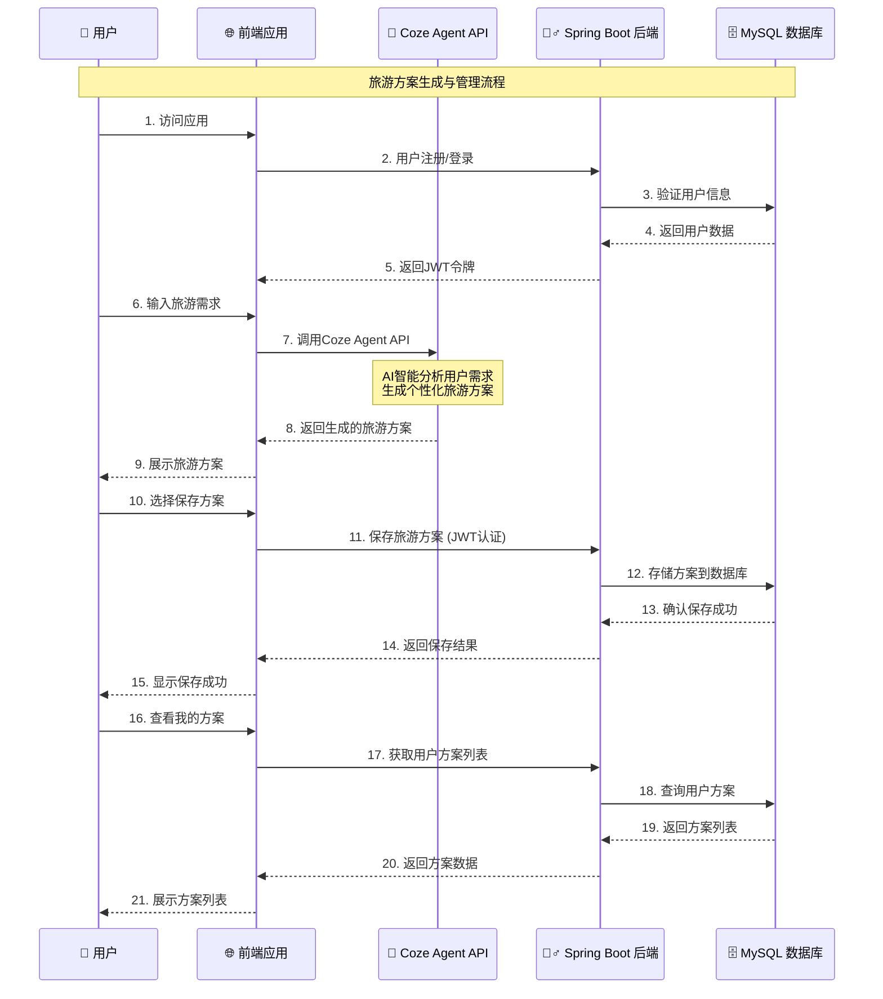
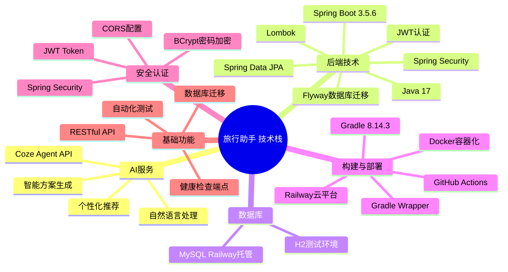
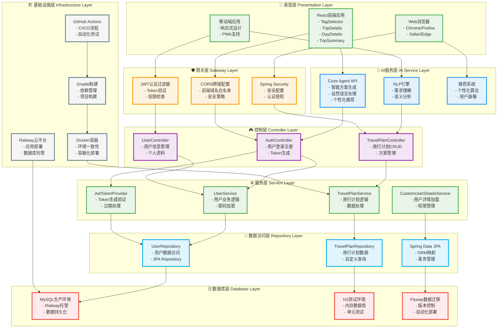
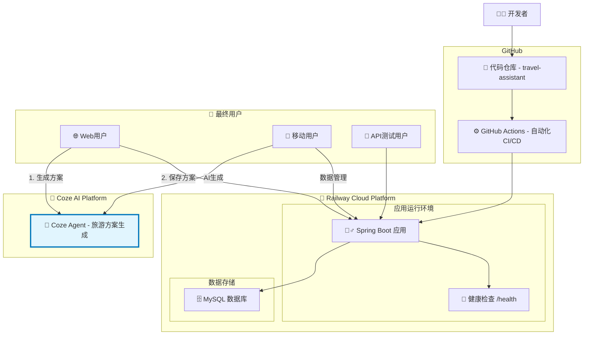
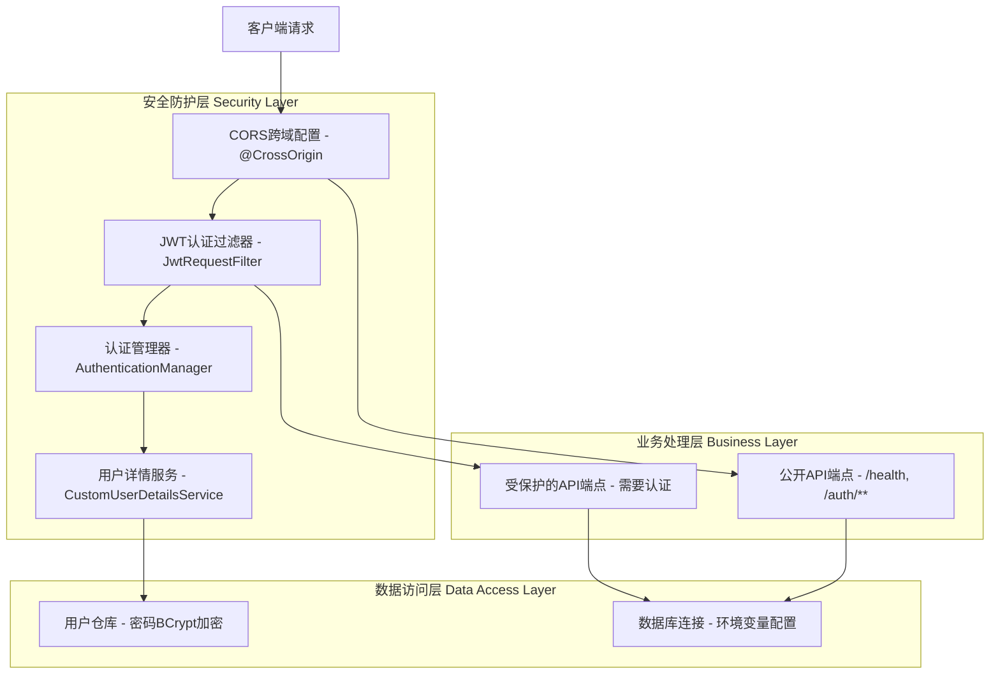

# 旅行助手系统架构图

## 整体架构概览

## 详细系统架构

```mermaid
graph TB
    %% 用户端
    subgraph "用户端 Client Side"
        WEB["Web浏览器 - 前端应用"]
        MOBILE["移动应用"]
        API_CLIENT["API客户端"]
    end
    
    %% AI服务层
    subgraph "AI服务层 AI Service Layer"
        COZE_API["Coze Agent API - AI旅游方案生成"]
    end
    
    %% Railway部署环境
    subgraph "Railway Cloud Platform"
        %% Spring Boot应用详细结构
        subgraph "Spring Boot 应用 Application"
            subgraph "控制层 Controller Layer"
                AUTH_CTRL["AuthController - 用户认证"]
                USER_CTRL["UserController - 用户管理"] 
                PLAN_CTRL["TravelPlanController - 旅行计划管理"]
            end
            
            subgraph "安全层 Security Layer"
                JWT_FILTER["JWT认证过滤器 - JwtRequestFilter"]
                SEC_CONFIG["安全配置 - SecurityConfig"]
                JWT_PROVIDER["JWT令牌提供者 - JwtTokenProvider"]
            end
            
            subgraph "服务层 Service Layer"
                USER_SVC["UserService - 用户业务逻辑"]
                PLAN_SVC["TravelPlanService - 旅行计划业务逻辑"]
                USER_DETAILS["CustomUserDetailsService - 用户详情服务"]
            end
            
            subgraph "数据访问层 Repository Layer"
                USER_REPO["UserRepository - 用户数据访问"]
                PLAN_REPO["TravelPlanRepository - 旅行计划数据访问"]
            end
            
            HEALTH["/health - 健康检查端点"]
        end
        
        %% 数据库
        subgraph "MySQL 数据库"
            USERS_TABLE["users表 - 用户信息"]
            PLANS_TABLE["travel_plans表 - 旅行计划"]
            DAILY_TABLE["daily_plans表 - 每日计划"]
            TIPS_TABLE["travel_tips表 - 旅行贴士"]
        end
        
        %% 数据库迁移
        FLYWAY["Flyway数据库迁移 - 版本控制"]
    end
    
    %% 业务流程连接关系
    WEB -->|1. 用户输入需求| COZE_API
    COZE_API -->|2. 生成旅游方案| WEB
    WEB -->|3. 用户认证| AUTH_CTRL
    WEB -->|4. 保存方案| PLAN_CTRL
    WEB -->|5. 用户管理| USER_CTRL
    
    MOBILE -->|AI方案生成| COZE_API
    MOBILE -->|数据交互| AUTH_CTRL
    API_CLIENT -->|健康检查| HEALTH
    
    AUTH_CTRL --> JWT_FILTER
    USER_CTRL --> JWT_FILTER
    PLAN_CTRL --> JWT_FILTER
    
    JWT_FILTER --> SEC_CONFIG
    JWT_FILTER --> JWT_PROVIDER
    
    AUTH_CTRL --> USER_SVC
    USER_CTRL --> USER_SVC
    PLAN_CTRL --> PLAN_SVC
    
    USER_SVC --> USER_DETAILS
    USER_SVC --> USER_REPO
    PLAN_SVC --> PLAN_REPO
    
    USER_REPO --> USERS_TABLE
    PLAN_REPO --> PLANS_TABLE
    PLAN_REPO --> DAILY_TABLE
    PLAN_REPO --> TIPS_TABLE
    
    FLYWAY --> USERS_TABLE
    FLYWAY --> PLANS_TABLE
    FLYWAY --> DAILY_TABLE
    FLYWAY --> TIPS_TABLE
    
    %% 样式
    classDef ai fill:#e1f5fe,stroke:#0277bd,stroke-width:3px
    class COZE_API ai
```

## 实体关系图 (ERD)

## CI/CD与部署架构

## 业务流程架构

## 技术栈总览

## 分层技术架构图

## 技术栈详细说明

### 🎨 表现层 (Presentation Layer)
| 技术组件 | 版本/说明 | 主要功能 | 文件位置 |
|---------|----------|----------|----------|
| **React** | 18.x | 前端框架，组件化开发 | `travel-assistant-frontend/src/` |
| **TagSelector** | 自研组件 | 旅游偏好标签选择 | `components/TagSelector.js` |
| **TripDetails** | 自研组件 | 旅行方案详情展示 | `pages/TripDetailsPage.js` |
| **DayDetails** | 自研组件 | 每日行程详情 | `components/DayDetails.js` |
| **TripSummary** | 自研组件 | 旅行方案概览 | `components/TripSummary.js` |

### 🤖 AI服务层 (AI Service Layer)
| 技术组件 | 版本/说明 | 主要功能 | 集成方式 |
|---------|----------|----------|----------|
| **Coze Agent API** | v1.0 | 智能旅游方案生成 | REST API调用 |
| **自然语言处理** | Coze内置 | 用户需求理解与分析 | 前端直接调用 |
| **个性化推荐** | AI算法 | 基于用户偏好推荐 | `clients/cozeClient.js` |
| **重新规划服务** | 自研 | AI方案重新生成 | `services/cozeReplanService.js` |

### 🛡️ 网关层 (Gateway Layer)
| 技术组件 | 版本/说明 | 主要功能 | 实现文件 |
|---------|----------|----------|----------|
| **CORS配置** | Spring Boot | 跨域资源共享 | `SecurityConfig.java` |
| **JWT过滤器** | 自研 | Token验证与权限检查 | `JwtAuthenticationFilter.java` |
| **Spring Security** | 6.x | 安全框架配置 | `SecurityConfig.java` |

### 🎮 控制层 (Controller Layer)
| 控制器 | 主要端点 | 功能描述 | 实现文件 |
|---------|----------|----------|----------|
| **AuthController** | `/auth/register`, `/auth/login` | 用户认证管理 | `AuthController.java` |
| **UserController** | `/users/**` | 用户信息管理 | `UserController.java` |
| **TravelPlanController** | `/travel-plans/**` | 旅行计划CRUD | `TravelPlanController.java` |

### ⚙️ 服务层 (Service Layer)
| 服务类 | 主要职责 | 核心方法 | 实现文件 |
|---------|----------|----------|----------|
| **UserService** | 用户业务逻辑 | 注册、登录、密码加密 | `UserService.java` |
| **TravelPlanService** | 旅行计划逻辑 | 创建、查询、删除方案 | `TravelPlanService.java` |
| **CustomUserDetailsService** | 用户详情服务 | 权限管理、用户加载 | `CustomUserDetailsService.java` |
| **JwtTokenProvider** | JWT令牌管理 | 生成、验证、过期处理 | `JwtTokenProvider.java` |

### 💾 数据访问层 (Repository Layer)
| 仓库接口 | 继承关系 | 主要功能 | 实现文件 |
|---------|----------|----------|----------|
| **UserRepository** | JpaRepository | 用户数据CRUD | `UserRepository.java` |
| **TravelPlanRepository** | JpaRepository | 旅行计划数据管理 | `TravelPlanRepository.java` |
| **Spring Data JPA** | 框架 | ORM映射、事务管理 | 自动配置 |

### 🗄️ 数据库层 (Database Layer)
| 数据库 | 环境 | 用途 | 配置文件 |
|---------|----------|----------|----------|
| **MySQL** | 生产环境 | Railway云平台托管 | `application.yml` |
| **H2** | 测试环境 | 内存数据库 | `application-test.yaml` |
| **Flyway** | 迁移工具 | 数据库版本控制 | `V1__create_users_table.sql` |

### 🏗️ 基础设施层 (Infrastructure Layer)
| 组件 | 版本 | 主要功能 | 配置文件 |
|---------|----------|----------|----------|
| **Railway云平台** | SaaS | 应用部署、数据库托管 | 环境变量 |
| **Docker** | 24.x | 容器化部署 | `Dockerfile` |
| **GitHub Actions** | CI/CD | 自动化测试、构建、部署 | `.github/workflows/` |
| **Gradle** | 8.14.3 | 构建工具、依赖管理 | `build.gradle` |

## 核心技术选型说明

### 🎯 **架构优势**
- **分层清晰**: 严格按照分层架构设计，职责明确
- **技术现代**: 采用Spring Boot 3.x + React 18最新技术栈
- **AI驱动**: 核心功能基于Coze AI平台，智能化程度高
- **云原生**: 基于Railway平台，支持自动扩缩容
- **安全可靠**: JWT + Spring Security双重安全保障

### 🔧 **技术亮点**
- **前后端分离**: React前端专注用户体验，Spring Boot后端专注业务逻辑
- **AI集成**: 前端直接调用Coze API，减少后端AI处理复杂度
- **数据库迁移**: Flyway确保数据库版本一致性
- **容器化部署**: Docker保证环境一致性
- **自动化CI/CD**: GitHub Actions实现全流程自动化

## 简化部署架构图

## 安全架构

## 核心功能模块

| 模块 | 功能描述 | 主要组件 | 现状 |
|------|----------|----------|------|
| **AI方案生成** | **Coze Agent智能生成旅游方案** | **前端调用Coze API** | **🔥 核心功能** |
| 用户管理 | 用户注册、登录、JWT认证 | AuthController, UserService, SecurityConfig | ✅ 已实现 |
| 旅行计划 | 创建、查看、删除旅行计划 | TravelPlanController, TravelPlanService | ✅ 已实现 |
| 预算管理 | 预算分配和跟踪 | BudgetBreakdownDTO, 预算相关实体字段 | ✅ 已实现 |
| 每日行程 | 详细的每日旅行安排 | DailyPlan实体, DailyPlanDTO | ✅ 已实现 |
| 旅行贴士 | 个性化旅行建议 | TravelTip实体, 相关服务方法 | ✅ 已实现 |
| 数据持久化 | 数据库操作和迁移 | JPA Repositories, Flyway | ✅ 已实现 |
| 安全认证 | JWT令牌管理和权限控制 | Spring Security, JWT工具类 | ✅ 已实现 |
| CI/CD | 自动化测试、构建、部署 | GitHub Actions, Railway平台 | ✅ 已实现 |
| 健康检查 | 应用状态监控 | /health端点 | ✅ 已实现 |

## 项目特点

### ✅ **已实现的核心特性**
- **AI驱动**: 前端集成Coze Agent API，智能生成个性化旅游方案
- **前后端分离**: 前端负责AI交互，后端专注数据管理
- **简洁架构**: 无复杂的网关、负载均衡器
- **云原生**: 基于Railway平台的一体化部署
- **自动化**: GitHub Actions完整的CI/CD流程
- **安全性**: JWT认证 + Spring Security
- **数据完整性**: Flyway数据库版本控制
- **容器化**: Docker部署，环境一致性

### 🎯 **架构优势**
- **智能化**: Coze AI提供专业的旅游方案生成能力
- **职责清晰**: 前端处理AI交互，后端负责数据持久化
- **开发简单**: 专注业务逻辑，无需复杂基础设施
- **部署便捷**: Railway一键部署，自动扩缩容
- **成本控制**: 按使用量付费，适合初期项目
- **快速迭代**: 自动化CI/CD，快速交付新功能

### 🔥 **核心业务流程**
1. **用户输入** → 前端收集旅游需求
2. **AI生成** → Coze Agent API智能生成方案
3. **用户确认** → 前端展示生成的方案
4. **数据保存** → 后端API保存用户选择的方案
5. **方案管理** → 后端提供CRUD操作

### 🚀 **未来扩展计划**
- **AI能力增强**: 集成更多AI服务，提升方案质量
- **实时更新**: WebSocket实现方案生成进度推送
- **外部API集成**: 地图服务、天气API、酒店预订等
- **移动端应用**: 原生移动应用开发
- **缓存层**: Redis缓存提升性能
- **文件存储**: 图片、文档上传功能
